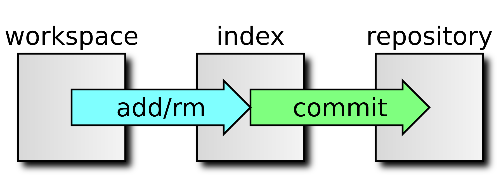
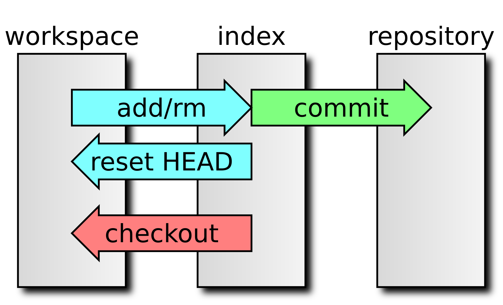
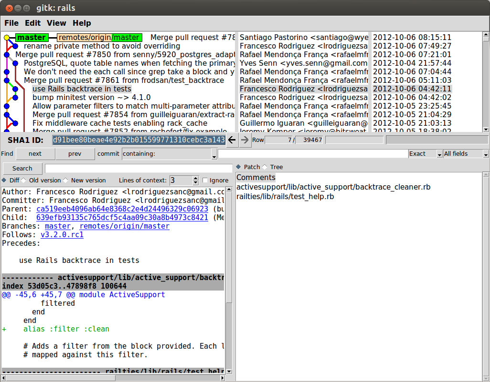
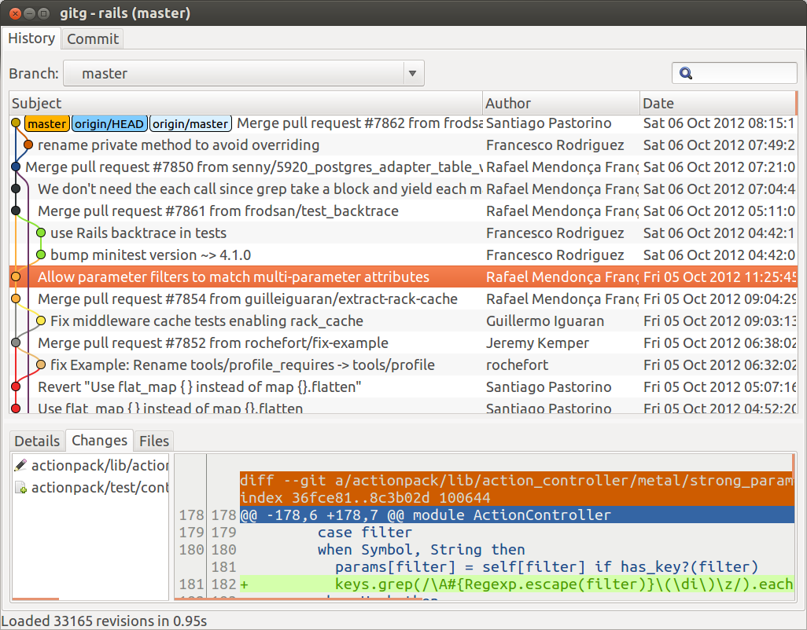
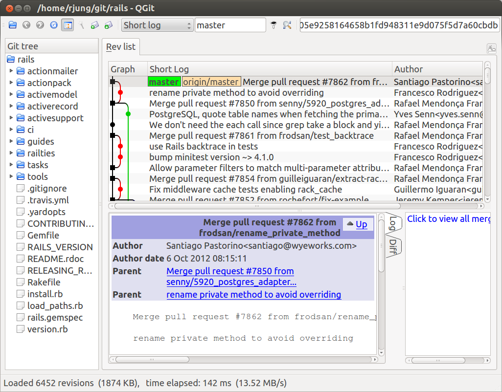

Simple Usage
============

Creating a local repository
---------------------------

Let's start with easy examples. You have now installed git and want to create
your first local git repository. So we create a empty directory and initialize
the repository with `git init`.

    user:~/git$ mkdir example1
    user:~/git$ cd example1/
    user:~/git/example1$ git init
    Initialized empty Git repository in /home/user/git/example1/.git/
    user:~/git/example1$

So, we just created our first empty git repository. But what happened? Git
created a directory called .git with several files. This directory is the
local repository. Using this repository for your own, this is the main place,
where the whole history of your files is stored.

Adding a file to the repository
-------------------------------

Let's add a file to the repository. For example, you've just created a file
named `index.php`, and before you go any further, you want to make sure, you
can get this version back at any time. So this is, what you will do:

If i want to know, the status of all files within the project, i call `git
status`:

    user:~/git/example1$ ls
    index.php
    user:~/git/example1$ git add index.php
    user:~/git/example1$ git commit -m "Initial commit"
    [master (root-commit) c7397f3] Initial commit
     1 file changed, 1 insertion(+)
     create mode 100644 index.php
    user:~/git/example1$

Congratulations, you've just added the first file to your repository. But what
has really happened? First you added the file `index.php` to the git index
(`git add index.php`). What is the index? The easiest way to think of the
index, as a pre-commit staging area. Everything you decide to commit to the
repository can be prepared with the index. You can use git without using the
index, For git, any change you do can be in one of three stages. First, it's
in your *workspace*. Then you put it to the index, and finally it's stored to
the *repository*. We just moved the new file `index.php` from workspace to
index and then to the repository:

But there are some differences between these two commands. I had different
arguments for them. The first command `git add index.php` told git, which
files to add to the index. When moving the index to the repository, it's not
neccesary any more to specify the files, as all files of the index are put
into the repository. But there was another option given with this command `git
commit -m "Initial commit"`, i did set a message to know again later, what was
done with this commit. If you omit the option *-m*, git will open a editor for
you, to enter a message for the given commit.

Updating a file
---------------

Now you have changed something within the file. And actually, it's the same
like adding a file. First you add the Change to the index, and then commit to
the repository.

    user:~/git/example1$ git add index.php
    user:~/git/example1$ git commit -m "Updated index.php"
    [master fce8de1] Updated index.php
     1 file changed, 1 insertion(+)
    user:~/git/example1$
    Removing a file

Removing is quite similar to adding a file, the only difference is the command
rm instead of add.

    user:~/git/example1$ git rm index.php
    rm 'index.php'
    user:~/git/example1$ git commit -m "Removed index.php"
    [master 6186836] Removed index.php
     1 file changed, 2 deletions(-)
     delete mode 100644 index.php
    user:~/git/example1$

To remove a file, you first have to stage the removal on the index, and then
commit it to the repository. So the complete workflow now looks like this:

What's the status?
------------------

You probably don't always know, which files have been changed, after you have
worked for a while. So you need to know, what the status is. Here's an example
output of `git status` with new/changed/removed files in the workspace and
index:

    user:~/git/example1$ git status 
    # On branch master
    # Changes to be committed:
    #   (use "git reset HEAD <file>..." to unstage)
    #
    #       modified:   changed_file_in_index
    #       deleted:    removed_file_in_index
    #       new file:   new_file_in_index
    #
    # Changes not staged for commit:
    #   (use "git add/rm <file>..." to update what will be committed)
    #   (use "git checkout -- <file>..." to discard changes in working directory)
    #
    #       modified:   changed_file_in_workspace
    #       deleted:    removed_file_in_workspace
    #
    # Untracked files:
    #   (use "git add <file>..." to include in what will be committed)
    #
    #       new_file_in_workspace
    user:~/git/example1$

As you see, git already tries to help you, how to deal with the changes by
giving you the examples, how to move the changes between workspace, index and
repository. Here are two further commands shown, `checkout` and `reset HEAD`.

What happend so far?
--------------------

You probably also want to see, what changes have happened so far in the
repository or a given file. You can retrieve this information by getting the
log-information:

    user:~/git/example1$ git log
    commit f125c1f3529dbbc9baad773f3633d48ee9f1b30a
    Author: Rainer Jung <Rainer.Jung@gmail.com>
    Date:   Thu Aug 2 23:32:59 2012 +0200

        Added files for workspace

    commit a4788319fbd5bcb9dfa9ebbf57d8f3c61c7337db
    Author: Rainer Jung <Rainer.Jung@gmail.com>
    Date:   Thu Aug 2 23:32:32 2012 +0200

        Added files to repository

    commit 6186836aad408cd71dee02443bc58403305efc30
    Author: Rainer Jung <Rainer.Jung@gmail.com>
    Date:   Thu Aug 2 23:16:51 2012 +0200

        Removed index.php

    commit fce8de1ca82294e7f8bc5f3427f72b5df23d0cf9
    Author: Rainer Jung <Rainer.Jung@gmail.com>
    Date:   Thu Aug 2 23:13:09 2012 +0200

        Updated index.html

    commit c7397f3d97addf8157b2d84747690548691a0da0
    Author: Rainer Jung <Rainer.Jung@gmail.com>
    Date:   Thu Aug 2 23:11:57 2012 +0200

        Initial commit
    user:~/git/example1$ git log changed_file_in_workspace
    commit f125c1f3529dbbc9baad773f3633d48ee9f1b30a
    Author: Rainer Jung <Rainer.Jung@gmail.com>
    Date:   Thu Aug 2 23:32:59 2012 +0200

        Added files for workspace
    user:~/git/example1$

You get a list of changeset-informations of all changes that have happened so
far. If a file is given as parameter, only the changes are shown that affected
the given file.

Each entry contains a commit-hash, the author, the time of the commit and the
description. The commit-hash is the identifier of exactly this changeset. The
hash would be a different one, if the changeset would have been applied at a
different time, by a different author, with a different description, or in any
other order.

So now you know, what generally has changed, but what was really changed
within the code?

What has changed with a changeset?
----------------------------------

Each changeset has a unique commit-hash. Using this hash, you can retrieve the
changes with `git show`.

    user:~/git/example1$ git show fce8de1ca82294e7f8bc5f3427f72b5df23d0cf9
    commit fce8de1ca82294e7f8bc5f3427f72b5df23d0cf9
    Author: Rainer Jung <Rainer.Jung@gmail.com>
    Date:   Thu Aug 2 23:13:09 2012 +0200

        Updated index.html

    diff --git a/index.php b/index.php
    index 69f7246..264107e 100644
    --- a/index.php
    +++ b/index.php
    @@ -1 +1,2 @@
     <? echo('Hello World'); ?>
    +It's now <? echo date('h:i') ?>.
    user:~/git/example1$

As you see for the changeset with the given commit-hash, there was a new line
added to `index.php`. sending the current date to the user.

You don't need to use the complete commit-hash. As long it starts from the
beginning until it's ambiguous, mostly the first 6 characters are enough (like
`git show fce8de1c`).

More Informations?
------------------

Though, you can get all information via the command-line, to get a real overview (especially, when you start branching, it's a good idea to use a visualization of the whole repository. Here are some screen shots, how they look.

###gitk

###gitg

###qgit

Gotchas
=======

The workspace contains all local changes, the index contains preselected
changes to be committed to the repository, where all changes will be stored.

Each changeset has a unique commit-hash. Any kind of "evil" manipulation would
result in a different hash.
